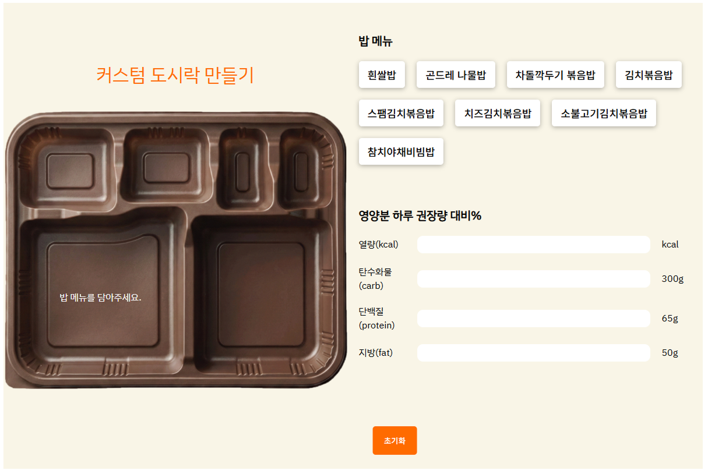

# 🍱 채선당 도시락&샐러드
채선당 도시락&샐러드 공식 사이트가 브랜드 소개 중심으로 구성되어 있어, 사용자들이 직접 상품을 구매할 수 있는 판매 사이트 형태로 리뉴얼했습니다.

## 🛠️ 기술스택
- React
- Redux Toolkit
- React Router
- Styled-components

## 📌 주요기능
- 장바구니 상태 관리 및 수량 실시간 반영
- 체크된 장바구니 데이터를 기반으로 그래프 값 동적 업데이트 구현
- 검색어 기반 상품 필터링 기능 구현
- 도시락 커스터마이징 기능 (선택에 따른 동적 이미지 변경)

## 📦 컴포넌트 구조
<pre>
chaesundang/
  ├── src/
  │ ├── component/            # 재사용 가능한 컴포넌트
  │   ├── Best.js             # Best 페이지
  │   ├── Footer.js           # Footer 기본 틀
  │   ├── Header.js           # 공용 Header
  │   ├── BrandPage.js        # 브랜드소개 페이지
  │   ├── CartPage.js         # 장바구니 페이지
  │   ├── Custom.js           # 나만의 도시락 만들기 콘텐츠
  │   ├── CustomStyled.js     # 나만의 도시락 만들기 styled-components
  │   ├── DetailPage.js       # 상세 페이지
  │   ├── FindPage.js         # 매장 찾기 페이지
  │   ├── Loign.js            # 로그인 페이지
  │   ├── MainPage.js         # 메인 페이지
  │   ├── MainPageStyled.js   # 메인 페이지 styled-components
  │   ├── NoticeDetail.js     # 공지사항 상세 페이지
  │   ├── NoticePage.js       # 공지사항 페이지
  │   ├── ProductBox.js       # 상품 기본 틀
  │   ├── SignUp.js           # 회원가입 페이지
  │   ├── store.js            # 장바구니 상태관리
  │   ├── SubPage.js          # 서브 페이지
  │   └── swiper.css          # swiper 스타일
  └── data/ 
      ├── data.js             # 모든 상품의 데이터
      ├── customData.js       # 나만의 도시락 만들기 데이터
      ├── findData.js         # 매장 찾기 데이터
      ├── noticeData.js       # 공지사항 데이터
      └── reviewData.js       # 리뷰 데이터
</pre>

## 🧠 설계 및 구현 과정
### 1. 장바구니 상태 관리 및 수량 실시간 반영
- 여러 컴포넌트에서 공통으로 사용하는 장바구니 특성상 Redux Toolkit을 도입하여 전역 상태로 관리
- cart slice로 액션과 reducer를 구조화하여 상태 변경 책임을 명확히 분리
- Header에서는 reduce()로 총 수량을 계산해 상태 변화에 따라 자동 반영되도록 구현

| 장바구니 수량 실시간 반영 |
|:--:|
|    |

#### store.js
```javascript
const cart = createSlice({
    name: 'cart',
    initialState: [],
    reducers: {
        addItem(state, action){ ... },
        deleteItem(state, action){ ... },
        ...
    }
});
```

#### Header.js
```jsx
// 장바구니에 저장된 정보가져옴
const cart = useSelector((state) => state.cart);

// reduce()를 활용하여 총 수량 계산
const totalCount = cart.reduce((total, item) => total + item.count, 0);
```

### 2. 체크된 장바구니 데이터를 기반으로 그래프 값 동적 업데이트 구현
- 체크 여부를 별도 상태로 관리하여 UI 제어 로직과 데이터 계산 로직을 분리
- 선택된 상품만 filter()로 추출하고 reduce()를 활용해 총 금액을 계산
- 계산된 값을 기준 금액 대비 퍼센트로 변환하여 표현용 데이터로 가공
- 가공된 값을 그래프 컴포넌트에 전달하여 상태 변화에 따라 자동 반영되도록 구현

| 장바구니 데이터를 기반으로 그래프 |
|:--:|
|    |

#### CartPage.js
```jsx
// 체크된 장바구니 상품 id를 상태로 관리
const [checkedList, setCheckedList] = useState(state.cart.map(item => item.id));

// 장바구니 데이터가 변경되면 체크리스트 동기화
useEffect(() => {
    setCheckedList(state.cart.map(item => item.id));
}, [state.cart.length]);

// 선택된 상품만 filter()로 추출 후, reduce()를 활용해 총 금액 계산
const checkedPrice = state.cart.filter(item => checkedList.includes(item.id))
    .reduce((total, item) => total + (item.price * item.count), 0);

// 계산된 총 금액을 기준 금액(40,000원)과 비교해 퍼센트로 변환
<BarFill $percent={(checkedPrice / 40000) * 100}/>
```

### 3. 데이터 분리
- 기능별(상품, 커스터마이징, 매장, 공지사항)로 데이터를 파일 단위로 분리하여 관심사를 구분하고 유지보수성을 고려
- **data.js**: defaultScore와 cartCount 값을 설계하여 장바구니 추가 수에 따라 Best 영역 랭킹이 동적으로 변경되도록 구조화
- **customData.js**: price 및 nutrition 속성을 포함한 객체 구조로 설계하여 선택 항목을 순회하며 총 금액 및 영양 값을 계산할 수 있도록 구성

#### data.js
```javascript
const products = [
  {
        id: 6,
        category: '스페셜 도시락',
        name: '고추장제육 도시락',
        subTitle: '화끈한 불향과 매콤한 유혹, 지친 하루에 에너지를 더하다',
        price: 10600,
        productImg: process.env.PUBLIC_URL + '/images/SpicyPorkBox.png',
        detailImg: process.env.PUBLIC_URL + '/images/SpicyPorkBox_Detail.png',
        isMD: false,
        defaultScore: 800,
        cartCount: 150,       
        nutrition: {
            kcal: 900,
            carb: 95,
            protein: 33,
            fat: 38,
        }
    },
    {
        id: 7,
        category: '스페셜 도시락',
        name: '등심돈까스 도시락',
        subTitle: '바삭한 튀김옷 속 꽉 찬 고기, 정통 돈까스의 든든함',
        price: 11200,
        productImg: process.env.PUBLIC_URL + '/images/PorkCutletBox.png',
        detailImg: process.env.PUBLIC_URL + '/images/PorkCutletBox_Detail.png',
        isMD: true,
        defaultScore: 400,
        cartCount: 250,
        nutrition: {
            kcal: 1050,
            carb: 110,
            protein: 32,
            fat: 48,
        }
    },
];
```

#### customData.js
```javascript
const custom = {
    rice: [
        {
            id: 101,
            name: '흰쌀밥',
            customImg: process.env.PUBLIC_URL + '/images/WhiteRice.png',
            price: 1000,
            nutrition : {
                kcal: 300,
                carb: 67,
                protein: 6,
                fat: 0.6
            }
        }
    ...
    ],
  main: [],
  ...
};
```

#### 🔧 트러블슈팅: Best 랭킹 동적 변경
#### 개선 전
> 장바구니 count 값을 기반으로 Best 랭킹을 계산했으나, 페이지 전환 시 데이터가 초기화되어 랭킹이 유지되지 않는 문제가 발생
```javascript
const products = [
  {
        id: 6,
        category: '스페셜 도시락',
        name: '고추장제육 도시락',
        subTitle: '화끈한 불향과 매콤한 유혹, 지친 하루에 에너지를 더하다',
        price: 10600,
        productImg: process.env.PUBLIC_URL + '/images/SpicyPorkBox.png',
        detailImg: process.env.PUBLIC_URL + '/images/SpicyPorkBox_Detail.png',
        isMD: false,   
        nutrition: {
            kcal: 900,
            carb: 95,
            protein: 33,
            fat: 38,
        }
    }
];
```

#### 개선 후
> 랭킹 기준이 되는 기본 점수(defaultScore)와 장바구니 반영 값(cartCount)을 데이터에 명시적으로 추가하여 UI 계산 기준을 구조적으로 분리
```javascript
const products = [
  {
        id: 6,
        category: '스페셜 도시락',
        name: '고추장제육 도시락',
        subTitle: '화끈한 불향과 매콤한 유혹, 지친 하루에 에너지를 더하다',
        price: 10600,
        productImg: process.env.PUBLIC_URL + '/images/SpicyPorkBox.png',
        detailImg: process.env.PUBLIC_URL + '/images/SpicyPorkBox_Detail.png',
        isMD: false,
        defaultScore: 800,
        cartCount: 150,       
        nutrition: {
            kcal: 900,
            carb: 95,
            protein: 33,
            fat: 38,
        }
    }
];
```

### 4. 검색어 기반 상품 필터링 기능 구현
- 검색어를 상태로 관리하여 입력값을 기준으로 UI가 즉시 반응하도록 설계
- filter()와 includes()를 활용해 부분 일치하는 상품만 추출하도록 구성

| 검색어 기반 필터링 |
|:--:|
|    |

```jsx
// 검색어 상태관리
const [search, setSearch] = useState('');

// filter()와 includes()를 사용하여 입력값과 일치하는 상품 실시간 필터링
const filterMenus= data.filter((item) => item.name.includes(search));
```

### 5. 도시락 커스터마이징 기능
- 단계별(rice, main, side) 선택 구조를 객체 형태로 설계하여 확장성과 상태 관리의 일관성을 고려
- 선택된 항목을 순회하며 price 및 nutrition 값을 합산하도록 데이터 구조를 설계
- useMemo를 활용해 selection 변경 시에만 재계산되도록 구성하여 불필요한 연산을 방지
- 선택된 메뉴를 조합해 하나의 커스텀 상품 객체로 생성하고, 기존 장바구니 로직과 동일한 흐름으로 처리되도록 설계

| 도시락 커스터마이징 기능 |
|:--:|
|    |

```jsx
// 단계별(rice, main, side) 선택 구조를 객체 형태로 상태 관리
const [selection, setSelection] = useState({
  rice: null,
  main: null,
  side01: null,
  side02: null,
  side03: null,
  side04: null
});

// 선택된 상품의 가격 및 영양 합산
// 선택된 상품이 변경될 때만 재계산되도록 useMemo 사용
const totals = useMemo(() =>{
let resualtTotal = { kcal: 0, carb: 0, protein: 0, fat: 0, price: 0 };

Object.values(selection).forEach(path => {
  if(path){
    resualtTotal.price += path.price;
  }

  if(path && path.nutrition){
    resualtTotal.kcal += path.nutrition.kcal;
    resualtTotal.carb += path.nutrition.carb;
    resualtTotal.protein += path.nutrition.protein;
    resualtTotal.fat += path.nutrition.fat;

  }
});
  return resualtTotal;
},[selection]);

// 완성 시 장바구니에 선택된 상품들의 이름을 나열
const customItem = {
  id: Date.now(),
  name: '나만의 커스텀 도시락',
  price: totals.price,
  subtitle: Object.values(selection)
    .filter(Boolean)
    .map(item => item.name)
    .join(' + ')
};
dispatch(addItem(customItem));
```

#### 🔧 트러블슈팅: 나만의 도시락 완성 후 활용
#### 개선 전
> 초기화 버튼만 존재하여, 커스터마이징 완료 후 행동 흐름이 단절, 결과물이 저장되지 않아 사용자 경험이 미완성된 느낌
<div>
  
</div>

#### 개선 후
> 선택된 메뉴를 하나의 커스텀 상품 객체로 생성하여 장바구니에 추가하도록 개선, 커스터마이징 → 구매 흐름으로 자연스럽게 연결
```javascript
const customItem = {
  id: Date.now(),
  name: '나만의 커스텀 도시락',
  price: totals.price,
  subtitle: Object.values(selection)
    .filter(Boolean)
    .map(item => item.name)
    .join(' + ')
};
dispatch(addItem(customItem));
```

### ✨ 프로젝트를 통해
React를 사용하여 데이터를 배열로 관리하고 map을 활용해 동적으로 UI를 렌더링하며 컴포넌트 기반 설계 방식에 대해 이해했습니다.
